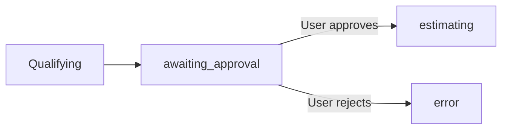

# Floras Orchestrator

Agent orchestration platform for the Floras climate pipeline � from lead
discovery to personalized presentation. A monorepo built with Turborepo,
Next.js, and TypeScript, powered by DeepSeek LLM with Neo4j-backed
persistence.

## Architecture

```
┌─────────────────────────────────────────────────────────────┐
│                      apps/web (Next.js)                     │
│  ┌─────────────┐  ┌──────────┐  ┌──────────────────────┐   │
│  │ PipelineView │  │AgentCards│  │ LogStream / Results  │   │
│  └──────┬───────┘  └────┬─────┘  └──────────┬───────────┘   │
│         │               │                    │               │
│         └───────────────┼────────────────────┘               │
│                         │  SSE (EventSource)                 │
├─────────────────────────┼───────────────────────────────────┤
│           packages/orchestrator                              │
│  ┌──────────────────────────────────────────────────────┐   │
│  │                   PipelineEngine                     │   │
│  │                                                     │   │
│  │  idle → discovering → qualifying → awaiting_approval │   │
│  │        → estimating → recommending → presenting      │   │
│  │                        → complete                    │   │
│  └──────────────────────────────────────────────────────┘   │
│         │              │              │                      │
│  ┌──────▼──────┐ ┌─────▼─────┐ ┌──────▼──────────┐         │
│  │ Sales Intel │ │CO2 Est.   │ │ Project Advisor │  ...    │
│  │  (LLM/Stub) │ │ (LLM/Stub)│ │   (LLM/Stub)    │         │
│  └──────┬──────┘ └─────┬─────┘ └──────┬──────────┘         │
│         │              │              │                      │
│         └──────────────┼──────────────┘                      │
│                        │                                     │
├────────────────────────┼─────────────────────────────────────┤
│              packages/shared                                 │
│  ┌──────────┐  ┌──────────┐  ┌──────────┐  ┌──────────┐    │
│  │  Types   │  │  Zod     │  │  Neo4j   │  │ EventBus │    │
│  │ Pipeline │  │ Schemas  │  │ Client   │  │  (SSE)   │    │
│  │ Context  │  │ (API)    │  │ Run/Log  │  │ pub/sub  │    │
│  │ Domain   │  │          │  │ Domain   │  │          │    │
│  └──────────┘  └──────────┘  └────┬─────┘  └──────────┘    │
│                                   │                         │
└───────────────────────────────────┼─────────────────────────┘
                                    │
                              ┌─────▼─────┐
                              │   Neo4j   │
                              │  Graph DB │
                              └───────────┘
```

### Monorepo structure

```
Floras-Orchestrator/
├── apps/
│   └── web/                     # Next.js dashboard
│       └── app/
│           ├── api/runs/        # REST API (create, get, approve)
│           ├── components/      # PipelineView, AgentCards, LogStream, etc.
│           ├── hooks/           # useSSE (EventSource streaming)
│           ├── demoData.ts      # Static demo dataset
│           ├── page.tsx         # Dashboard entry point
│           └── layout.tsx       # Root layout
├── packages/
│   ├── orchestrator/            # Pipeline engine + agents
│   │   └── src/
│   │       ├── engine.ts        # State machine, retry, resume, gates
│   │       ├── llm.ts           # DeepSeek/OpenAI client factory
│   │       ├── logger.ts        # Structured logger (SSE + Neo4j + stdout)
│   │       └── agents/
│   │           ├── base-agent.ts        # FlorasAgent interface
│   │           ├── base-llm-agent.ts    # LLM agent with streaming
│   │           ├── schemas.ts           # Zod output schemas
│   │           ├── sales-intel*.ts      # Lead discovery + qualification
│   │           ├── co2-estimator*.ts    # Carbon footprint estimation
│   │           ├── project-advisor*.ts  # Climate project recommendations
│   │           └── design-system*.ts    # Presentation/email/one-pager gen
│   ├── shared/                  # Types, Neo4j client, EventBus
│   │   └── src/
│   │       ├── types.ts         # PipelineRun, PipelineContext, domain models
│   │       ├── schemas.ts       # Zod validation for API inputs
│   │       ├── neo4j.ts         # Graph DB persistence layer
│   │       └── events.ts        # In-process pub/sub for SSE
│   └── ui/                      # Shared UI package (placeholder)
├── .env.example                 # Required environment variables
├── turbo.json                   # Turborepo pipeline config
├── pnpm-workspace.yaml          # pnpm workspace definition
└── tsconfig.base.json           # Shared TypeScript config
```

## Pipeline Stages

| Stage | Agent | Description |
|---|---|---|
| `discovering` | Sales Intelligence | Discovers 3�5 leads matching target description |
| `qualifying` | Sales Intelligence | Scores leads 0�100 with weighted qualification factors |
| `awaiting_approval` | **Human Gate** | User reviews qualified leads, approves or rejects |
| `estimating` | CO2 Estimator | Estimates annual carbon footprint per lead (Scope 1/2/3) |
| `recommending` | Project Advisor | Recommends Floras climate projects matched to each lead |
| `presenting` | Design System | Generates presentation outline, email template, one-pager |
| `complete` | � | Pipeline finished successfully |

## How Agents Communicate

Agents share data through a cumulative **PipelineContext**:

```typescript
interface PipelineContext {
  leads: Lead[];                    // Sales Intel writes
  qualifications: Qualification[];  // Sales Intel writes
  estimates: CO2Estimate[];         // CO2 Estimator reads leads, writes estimates
  recommendations: ProjectRecommendation[];  // Project Advisor reads leads+quals
  artifacts: Artifact[];            // Design System reads everything
}
```

Each agent's `buildUserMessage()` method reads from `input.context` and formats
the accumulated data into an LLM prompt. The context is persisted to Neo4j after
every stage, enabling **pipeline resume** after failures.

## Dual Agent Mode (LLM / Stub)

The engine chooses agents at startup based on environment:

| Condition | Agents Used |
|---|---|
| `LLM_ENABLED=true` + valid API key | Real `BaseLLMAgent` subclasses (DeepSeek) |
| Otherwise | Stub agents with hardcoded demo data |

Stubs simulate realistic latency and return complete demo datasets, so the
pipeline works offline for development and demo purposes.

## Error Detection & Recovery

### Detection (three layers)

1. **Agent-level** � `BaseAgent.run()` wraps `execute()` in try/catch.
   `BaseLLMAgent` additionally validates the LLM's JSON output against a Zod
   schema.
2. **Engine retry loop** � `runAgentWithRetry()` retries up to `maxRetries`
   (default 2) with linear backoff, plus a `Promise.race` timeout per attempt.
3. **Pipeline catch-all** � `executeRun()` has a top-level try/catch that
   transitions to the `error` stage and emits an `run_error` SSE event.

### Recovery

```typescript
engine.resumeRun(runId, targetStage?)
```

Restores the `PipelineContext` snapshot from Neo4j, determines the last
successful stage, and re-executes from there. No work is duplicated.

## Human Approval Gate

After qualification, the pipeline **blocks** on `awaiting_approval`. The
dashboard shows qualified leads with their scores, and the user must click
**Approve** or **Reject** to continue. On rejection, the run transitions to
`error` and stops.



## Extending with New Agents

Adding an agent requires changes in **four well-defined spots** � no existing
code modifications needed:

1. **Implement `FlorasAgent`** � extend `BaseAgent` or `BaseLLMAgent`
2. **Add Zod output schema** � in `agents/schemas.ts`
3. **Register in engine constructor** � add to the `Map<string, FlorasAgent>`
4. **Wire into the pipeline** � add to `STAGE_AGENTS` and `TRANSITIONS`

```typescript
// Example: adding a Legal Compliance agent
// 1. Create agents/legal-compliance.ts
export class LegalComplianceAgent extends BaseLLMAgent { ... }

// 2. Register in engine.ts constructor
this.agents.set("legal-compliance", new LegalComplianceAgent(...));

// 3. Wire stage mapping
STAGE_AGENTS["complying"] = "legal-compliance";

// 4. Add transition
TRANSITIONS.recommending.push("complying");
```

## Getting Started

### Prerequisites

- **Node.js** >= 18
- **pnpm** >= 9 (`npm install -g pnpm`)
- **Neo4j** (optional � pipeline works in memory-only mode without it)

### Install

```bash
pnpm install
```

### Configure

```bash
cp .env.example .env
```

Edit `.env` with your keys:

```env
# Neo4j (optional � leave defaults if not using)
NEO4J_URI=bolt://localhost:7687
NEO4J_USER=neo4j
NEO4J_PASSWORD=password

# DeepSeek LLM (optional � stub agents used if disabled or no key)
LLM_ENABLED=true
LLM_PROVIDER=deepseek
LLM_API_KEY=sk-your-deepseek-api-key
LLM_MODEL=deepseek-chat
LLM_BASE_URL=https://api.deepseek.com
LLM_TEMPERATURE=0.3
LLM_MAX_TOKENS=4000
```

The LLM provider is OpenAI-compatible � you can swap DeepSeek for OpenAI,
Groq, or any compatible API by changing `LLM_BASE_URL` and `LLM_MODEL`.

### Run

```bash
pnpm dev
```

Opens the dashboard at `http://localhost:3000`. Enter a lead discovery prompt,
click **Run Pipeline**, and watch the agents execute in sequence with live
streaming output.

## API Endpoints

| Method | Path | Description |
|---|---|---|
| `POST` | `/api/runs` | Create and start a new pipeline run |
| `GET` | `/api/runs` | List all runs |
| `GET` | `/api/runs/:id` | Get a single run with agent outputs |
| `POST` | `/api/runs/:id/approve` | Approve or reject at the human gate |
| `GET` | `/api/runs/:id/events` | SSE stream for live dashboard updates |

## SSE Event Types

The dashboard receives these events in real-time via `EventSource`:

| Event | Data | Triggers |
|---|---|---|
| `stage_change` | `{ runId, from, to }` | Pipeline progress bar update |
| `agent_status` | `{ runId, agentId, status }` | Agent card status change |
| `log` | `LogEntry` | Log stream append |
| `gate` | `GateEvent` | Approval dialog display |
| `agent_stream` | `{ runId, agentId, content, done }` | Live LLM token output |
| `run_complete` | `{ runId }` | Terminal success state |
| `run_error` | `{ runId, error }` | Terminal error state |
| `run_resumed` | `{ runId, from }` | Recovery notification |
| `agent_retry` | `{ runId, agentId, attempt, error }` | Retry indicator |

## Tech Stack

| Layer | Technology |
|---|---|
| Frontend | Next.js 14, React 18, TypeScript |
| Pipeline engine | TypeScript state machine |
| LLM | DeepSeek (OpenAI-compatible, swappable) |
| Persistence | Neo4j (graph DB) with in-memory fallback |
| Validation | Zod (API inputs + LLM outputs) |
| Realtime | Server-Sent Events (SSE) |
| Monorepo | Turborepo + pnpm workspaces |

## Design Decisions

**Why Neo4j?** Pipeline data is inherently graph-shaped � leads connect to
qualifications, estimates, recommendations, and artifacts. A graph database
enables queries like "show me all leads with CO2 estimates over 100t whose
qualification score exceeds 80" in natural Cypher.

**Why SSE not WebSockets?** The dashboard needs unidirectional server-to-client
updates. SSE is simpler � no handshake protocol, automatic reconnect built into
EventSource, and the Next.js API route model maps cleanly to `ReadableStream`.

**Why Zod for LLM output?** LLMs return unstructured text. Zod schemas validate
the parsed JSON against the expected shape, catching hallucinations before
corrupt data enters the pipeline context. A validation failure triggers agent
retry.

**Why stub agents?** Enables the full pipeline to run without API keys for
development, demo, and CI. The stub data is realistic enough to verify the
dashboard UI, state machine transitions, and Neo4j persistence.

**Why human gates?** Qualification is the highest-stakes decision � bad leads
waste downstream LLM calls and could surface inappropriate recommendations.
The gate design (pending promise resolver) keeps the engine synchronous and
simple without polling.
